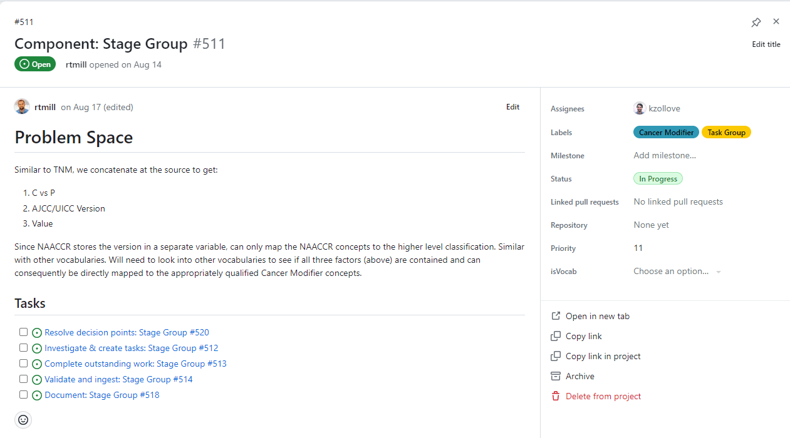

```{r load_packages, message=FALSE, warning=FALSE, include=FALSE} 
library(fontawesome)
```


# **Overview**

<br>

## **Architecture**

 - While most of the relevant "issues" exist within the OHDSI/OncologyWG repository, the project itself lives at the organization (OHDSI) level: https://github.com/orgs/OHDSI/projects/13
 - You can navigate the issues through the repository if you wish but it is much more organized and intuitive to leverage the "Views" within the project (see: Project Views below)

 
--- 

## **Strategy**

 - Leverage community feedback to establish dynamic inventory of maturity tasks 
 - Break down the problems into granular tasks
 - Follow a linear development cycle (see below) that always ends in validation and documentation 
 - Enable asynchronous development and contributions independent of whether able to attend meetings 
 - Prioritize work based on use cases but allow contributors to focus on what content applies to them 
 - Enable contributions from all levels of technical experience 
 - The end deliverables for each convention include:
    - Documentation within the Github.io page
    - Additions to delta "concept" and "concept_relationship" tables (see: [delta vocab readme](https://github.com/OHDSI/OncologyWG/tree/master/deltaVocab#ohdsi-oncology-workgroup-deltavocab))

--- 


# **Project Navigation**

<br>

## **Task status**

<br>

All views within the project use the same four "status" groups:

<div></img></div>

<br>

Blocked
: The prerequisites tasks are not complete and consequently the task is blocked.


Outstanding
: Available to be worked on but currently unassigned.


In Progress
: Assigned and being worked on. 


Complete
: Finished. 

<br> 

--- 

## **Project Views**

<br>

The Github "project" can be thought of as a mechanism to "slice up" or organize the Github issues into different groupings and subsets. Each "view" is a custom representation of those issues displayed for a specific reason. The most relevant of these views are described below.  

<div></img></div>

**Board**

- This view display all issues independent of type, grouped by status. This is the best option for viewing available tasks, changing their status, and assigning the tasks to individuals 

**Task Groups**

 - 'Task groups' are a collection of steps that we repeat for every convention. The intent is that every convention needs to go through the same (linear) process and end with the same steps of validation and documentation. Clicking on any task group issue will give you the same five sub-tasks (with slightly different names to represent the parent task group):

<div></img></div>

<br>

 - Task groups allow us to view the overall progress of "components" and assist with prioritization. For example, if a use case requires that conventions for "Metastasis" to be completed, we can view what the remaining work is. 
 - The "example walkthrough" below gives more detail into Task Groups

**Others**

 - The remaining views are intended to view all issues of a specific type within the "Task Group" process for instances where you want to drill down to a specific action. 
 - Those are:
    - Decision Points
    - Investigations
    - Outstanding (vocab) Work 
    - Validate and Ingest 
    - Documentation
 - These views can be helpful if a particular contributor is comfortable in a certain domain and can allow them to view the available 

---

<br>

# **Example walkthrough**

<br> 

--- 


## **Task group**
Start with a Task Group: a unit of work of orders related to a component of oncology research.
If you'd like to contribute to a specific Task Group, add yourself as an assignee and change the status from **Outstanding** to **In Progress**


<div></img></div>

<br>

Within the top comment on the Task Group issue, the Problem Space section contextualizes the problem and the Tasks section links to subissues that outline the steps for solving it.

Within each Task Group, there are typically five subissues: Resolve decision points, Investigate & create tasks, Complete outstanding work, Validate and ingest, and Document.


<div></img></div>

<br> 

--- 

## **Resolve Decision points**
This subissue lists the decision points that need to be finalized before work can begin on the Task Group. Decision points must be finalized by the OHDSI Oncology WG and often require input from oncologists and informaticists before they are introduced as discussion topics at a WG meeting. Generally, all decision point issues should be finalized and closed before work begins on a task group.

<div></img></div>

<br> 

--- 

## **Investigate and Create Tasks**

The next task in the Task Group involves scoping the work necessary to solve the problems laid out in the Problem Space. In the context of vocabulary development, this task may be broken into two main steps. The first involves outlining the preparatory work necessary to enable the Task Group’s main work. This means identifying vocabularies with problematic terms and creating a checklist for the preparatory work required:

<div></img></div>

After outlining the preparatory work, the second step of this task involves compiling the lists of terms from problematic vocabularies that will be addressed and repaired in the following task. Each of these lists of terms should become their own individual issue which is then linked to next task (Complete outstanding work):

<div></img></div>

These issues, which contain the first actual work orders, should be structured as shown above: a brief description of the work that needs to be done and a set of tables containing all of the concepts involved. In the task pictured above, the tables involved are a comprehensive “source” table of the concepts that need to be altered (likely destandardized and mapped to standard concepts), and the table of “target” concepts that should be mapped to.

- **NOTE**: *Linking to work orders.* A key part of this Task is to populate the Complete outstanding work ticket by linking to the work order tickets. This can be done by editing the top comment in the Complete outstanding work ticket as such:

<div></img></div>

Notice that checkboxes for task lists are created using “- [ ]” (note the space between the dash and open bracket, and the space between brackets). Issues are linked to checkboxes by referencing their issue number.

After all work order issues are created, linked to the “Complete outstanding work” issue, and referenced in a comment on this issue, all checkboxes in this issue can be checked and the issue closed:

<div></img></div>

<br> 

--- 

## **Complete outstanding work**

In the last task, you worked to add content to the top comment in this issue:

<div></img></div>

At this point, you are ready to start preparing the tables to create changes in the OHDSI Development Vocabulary.

The example above demonstrated the structure of the work order: a description of work to be done and a set of tables necessary to do the work. To complete the work order, we will download the linked CSV files, create empty concept and concept_relationship files, and start destandardizing

<div></img></div>

It's a good idea to adopt a naming convention that works for your data management style. Here, concept_SNOMEDtoCM_sg indicates that these are the SNOMED stage group concepts that are being destandardized and will be mapped to the Cancer Modifier stage group concepts.

<div></img></div>

The delta concept table (bottom) is fairly easy to create in this case. Since we are destandardizing all of these SNOMED concepts (left), we simply need to copy all of the terms to our new concept table and remove the ‘S’ from the standard_concept column.

- **NOTE**: watch out for the date formats. While accurate dates are not explicitly necessary for the Oncology WG efforts, having dates formatted as above (DD/MM/YYYY) can create errors for downstream tools. Use MM/DD/YYYY, MM-DD-YYYY, or YYYY-MM-DD, and always double check that your dates are saved correctly by opening your files in a non-Excel editor.

<div></img></div>

Now that the SNOMED concepts are destandardized, they need to be mapped to the standard Cancer Modifier concepts. This step involves combing through the table of Cancer Modifier concepts (bottom left) to find the “matching” term and adding a row to delta concept_relationship table (right). Remember that every “Maps to” relationship should have a reciprocal “Mapped from” relationship (not shown).

As you work, it can be very useful to leave comments on your thought process or anything out of the ordinary directly on the work order ticket:

<div></img></div>

After you've completed the work for a work order ticket, attach your output files to a comment and close the issue:

<div></img></div>

Closing the tickets will automatically check the boxes in the Task issue. Once all of the listed tasks have been completed, the entire Task issue can be closed:

<div></img></div>

<br> 

--- 

## **Validate and ingest**

> `r fa("circle-stop", fill="red", prefer_type="solid")` A small number of community members (who are familiar with this process) will handle the majority of validation and ingestion requests thus it is not required that these processes be fully understood by the majority. For more information see the Validation tooling [readme](https://github.com/OHDSI/OncologyWG/tree/master/vocabTools#tools-used-to-assist-with-developing-omop-vocabulary)


You will need the vocabTools directory and its contents downloaded to your computer to make use of the tools in the following steps. The easiest way to download vocabTools (and subsequently push Oncology Development Vocabulary changes back to GitHub) is by cloning the OncologyWG:

`git clone https://github.com/OHDSI/OncologyWG.git`

Part of the validate and ingest process involves standing up a “vocab” database. The tools presented here expect and require a PostgreSQL database with schemas “prod” (an “official” OMOP Vocabulary) and “dev” (a copy of prod that will be altered and used for staging). You can assume these tools will work for you if you have a prod and dev schema set up in a Postgres database, or follow detailed instructions for setting them up [here](https://github.com/OHDSI/OncologyWG/blob/master/vocabTools/README.md#setting-up-a-development-database).

After your database is set up with a prod and a dev schema, update the config.txt file to the correct connection information.

<div></img></div>

### Validate


In the last task, you created concept and concept_relationship table fragments to complete the vocabulary work orders. In this step, we will validate these locally by integrating them into the dev schema of the database we have set up and comparing the augmented dev schema and prod schema.

First, move all of the concept_*.csv and concept_relationship_*.csv files to the concept and concept_relationship directories in your local copy of vocabTools:

<div></img></div>

With your concept and concept_relationship CSV files in the appropriate folders, you can start ingesting them using the Batch files in the vocabTools directory. Start with `updateConcept.bat` to update the concept table in the dev schema. After that has run, execute `updateConceptRelationship.bat` to update the concept_relationship table. You can visually verify that these scripts ran correctly by executing and examining the output from the `getConceptDiffs.bat` and `getConceptRelationshipDiffs.bat` scripts. These scripts output all rows from concept and concept_relationship table in the dev schema that don't exist in the prod schema version. 

Once the concept and concept_relationship tables have been updated from the CSV files you created, you can update the concept_ancestor hierarchy by running `updateConceptAncestor.bat`.

> This process may take an hour or more to complete.

After you've updated the concept_ancestor table, you can visually verify that the changes were made by running `getConceptAncestorDiffs.bat`. Again, this script may take a few minutes to run.

### Ingest

The Oncology Development Vocabulary is persisted as two CSV files that represent the set of changes that should be made to the concept and concept_relationship table. These files are stored on the OncologyWG GitHub repository in the [deltaVocab directory](https://github.com/OHDSI/OncologyWG/tree/vocabTools/deltaVocab). More information on "deltatVocab" can be found [here](https://github.com/OHDSI/OncologyWG/blob/vocabTools/deltaVocab/README.md).

To "ingest" the changes that you have made to the Oncology Development Vocabulary, you will need to:
1. Add your changes to the deltaConcept.csv and deltaConceptRelationship.csv files
2. Add a deltaSummary file to summarize the changes that your additions make to the official OMOP Vocabulary
3. Create a pull request from a fork or branch of the OncologyWG GH to the master branch

These steps are detailed below.

#### Add changes to deltaVocab

Changes can be easily incorporated into the deltaVocab files by running `updateDelta.bat`. This script will look for, and ingest, any files in the vocabTools/concept and vocabTools/concept_relationship directories. It will also ensure that the most up-to-date deltaVocab is used as a starting point, and that only new changes are being added. Once this script has run successfully, the deltaVocab files on your computer will reflect your changes to the official OMOP Vocabulary, as well as all previously ingested changes.

#### Add a deltaSummary file

A standardized script is used to create a summary of the changes made. You can use `getSummary.bat` to generate a table that summarizes the difference between what is in your dev schema and your prod schema across the concept, concept_relationship, and concept_ancestor tables. This script will output the summary table as a file called deltaSummary<currentDate>.txt in the deltaVocab folder.

> Note: The summary table will *not* be accurate if you have made any additional changes to the dev or prod schema since running the updateConcept*.bat scripts.

##### Optional:

You can also choose to update the main deltaSummary file (deltaSummary.txt with no date in the filename), though this requires you to run the updateConcept*.bat scripts on the updated deltaVocab files. To update the main deltaSummary file:
1. Copy the deltaConcept and deltaConceptRelationship files to the vocabTools/concept and vocabTools/concept_relationship folders, respectively.
2. Rerun each update script (updateConcept.bat, updateConceptRelationship.bat, updateConceptAncestor.bat), thus updating your dev schema to the most up-to-date version of the Oncology Development Vocabulary (as of your changes).
3. Run `getSummary.bat full`. Specifying the argument "full" will update the main getSummary.txt file in deltaVocab.

#### Ingest to GitHub

Changes should be "ingested" via a Pull Request from your branch or fork of the OncologyWG to the master branch of OncologyWG:

<div></img></div>

<div></img></div>

If you've been working on your own branch/fork of the repo, simply commit and push your changes, select your branch/fork on [a PR to OncologyWG GitHub](https://github.com/OHDSI/OncologyWG/compare), and click **Create Pull Request**.

If you've been working directly on the master branch, you will need to first move your changes to a new branch, commit, and push the branch to GitHub:

```
git checkout -b your_branch_name

git add .
git commit -m "Your commit message here"

git push origin your_branch_name
```

After that, you can select your new branch on [a PR to OncologyWG GitHub](https://github.com/OHDSI/OncologyWG/compare), and click **Create Pull Request**.

> Note: Keep an eye out for feedback from the Oncology Development Vocabulary maintainers in the form of comments on your PR. They will let you if any changes need to be made before the PR can be accepted.

<br> 

--- 

## **Document**


 - Finalized documentation ends up in the 'Conventions' part of this site
 - We use rmarkdown 
   - We edit the markdown files and render them into html
   - rmarkdown::render_site() to convert rmd files into html files within the "docs" directory - which is where github.io pages pulls from

<br>

 There are three methods for contributing to our documentation documentation.
 
**Option 1)** Standard approach: **Use RStudio**
      
  - Edit the source files within the "rmd/" directory and save them
  - The rmarkdown contains a function which converts the rmd files into a full html website (and rewrites the "docs/" directory to do so) that is automatically published when merged


  ```      
   # start in rmd/ directory
  setwd(".../rmd")

  # generate html from rmd
  rmarkdown::render_site()
  ```
<br> 

        
**Option 2)** **Use Github.Dev** or other markdown editor
  
    - Leverages tools within Github Website
    - Can edit and visualize resulting documentation without needing to use R 
    
    Steps:

    1) Create a new branch from "main"
    2) Edit the RMD files and, once satisfied, push those commits to the new branch
    3)  Once completed, create a Pull Request
    > - There is a (finicky) Github Action in place that has the logic:
    >  - If a pull request gets created where anything in the "rmd/" folder was edited, then generate the HTML files
    > - By the time the pull request is reviewed, the "docs/" folder and contained HTML files should have been automatically generated from whatever you edited in "rmd/"

Tips: 
- Change the "language to markdown" in the bottom right corner


- After the language has been set to markdown, you can then switch to a split view which shows you the final visual result of the markdown file you are editing. To open the visualization tab click the split box with the magnifying glass in the top right


<br>

**Option 3)** If neither above options are feasible, you can write the documentation in whatever format you're comfortable with and 
1) submit the content as a comment in the github ticket
2) one of the repository maintainers will convert it into the proper format

